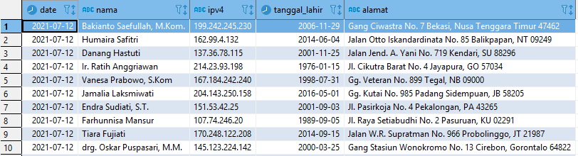

# End to End Streaming ETL Pipelines

Project ini menggunakan beberapa referensi `image` atau `container` berikut:

* `python-producer`: Python apps sebagai producer kafka.
    * Image: Dockerfile
    * References: https://hub.docker.com/_/python

* `zookeeper`: Zookerper kafka cluster manager.
    * Image: confluentinc/cp-zookeeper:6.2.0
    * Port: 22181
    * References: 
        * https://hub.docker.com/r/confluentinc/cp-zookeeper
        * https://github.com/confluentinc/kafka-images

* `kafka`: Kafka message broker.
    * Image: confluentinc/cp-kafka:6.2.0
    * Port: 29092
    * References: 
        * https://hub.docker.com/r/confluentinc/cp-kafka
        * https://github.com/confluentinc/kafka-images

* `spark`: Spark Master.
    * Image: docker.io/bitnami/spark:3
    * Port: 4040
    * References: 
        * https://hub.docker.com/r/bitnami/spark 
        * https://github.com/bitnami/bitnami-docker-spark        

* `spark-worker-N`: Spark Workers. Anda bisa menambahkan spark-worker di docker-compose file.
    * Image: docker.io/bitnami/spark:3
    * References: 
        * https://hub.docker.com/r/bitnami/spark 
        * https://github.com/bitnami/bitnami-docker-spark

* `postgres`: Postgres database menyimpan streaming data dari kafka.
    * Image: postgres:13.2
    * Database Port: 5432
    * References: https://hub.docker.com/_/postgres

* `hadoop`: Hadoop sebagai Data Lake & Data Warehouse.
    * Image: teivah/hadoop:2.9.2
    * Port: 50070
    * References: https://hub.docker.com/r/teivah/hadoop


### .
## Architecture Components


### .
## Requirements

- *Docker*
- *Docker Compose*
- *Git (optional)*


### .
## Setup

### Clone project

Clone repository ini dengan command:

    $ git clone https://github.com/arinannp/kafka-spark.git


### Build image dependencies

Pindah ke working direktori */kafka-spark*

- Build image `python-producer` dengan command:

        $ docker build --tag python-producer .
    
- Build images dependencies di dalam `docker-compose` dengan command:
        
        $ docker-compose -f docker-compose.yml build


### Start containers

Untuk running containers, Anda bisa jalankan command berikut
        
    $ docker-compose -f docker-compose.yml up -d

Note: command -d digunakan agar running di background.


### Check containers logs

Anda bisa cek logs dari containers yang sudah di build, apakah containers/apps tersebut sudah ready
        
    $ docker-compose -f docker-compose.yml logs --tail 10

Note: command --tail 10 hanya menampilkan 10 logs terakhir.


### Access the containers or apps that were built

Spark Master: http://localhost:4040

Hadoop Namenode: http://localhost:50070

Kafka Message Broker:
* Server: 
    - localhost:29092

Postgres Database menyimpan data streaming:
* Server: localhost:5432
* Database: postgres
* User: postgres
* Password: postgres


### .
## How to Run an End to End Streaming Pipelines

1. Pertama, jalankan python-producer apps dengan command:
```
docker run -it --rm --name python-producer --network streaming-net -e BOOTSTRAP_SERVER=kafka:9092 -e TOPIC_NAME=user_access python-producer
```

2. Buka terminal atau CLI di window baru, kemudian jalankan command berikut untuk print streaming data ke console (optional):
```
docker exec -it spark spark-submit --master spark://spark:7077 --packages org.apache.spark:spark-sql-kafka-0-10_2.12:3.1.2 /opt/bitnami/spark/project/spark_structured_streaming.py
```

3. Buka terminal atau CLI di window baru, kemudian jalankan command berikut untuk menyimpan data streaming ke Hadoop HDFS (http://localhost:50070):
```
docker exec -it spark spark-submit --master spark://spark:7077 --packages org.apache.spark:spark-sql-kafka-0-10_2.12:3.1.2 /opt/bitnami/spark/project/spark_structured_streaming_hadoop.py
```

4. Buka terminal atau CLI di window baru, kemudian jalankan command berikut untuk menyimpan data streaming ke Postgres DB:
```
docker exec -it spark spark-submit --master spark://spark:7077 --packages org.apache.spark:spark-sql-kafka-0-10_2.12:3.1.2 --driver-class-path /opt/bitnami/spark/connectors/postgresql-9.4.1207.jar --jars /opt/bitnami/spark/connectors/postgresql-9.4.1207.jar /opt/bitnami/spark/project/spark_structured_streaming_postgres.py
```


### .
## Documentations

- Spark submit jobs (http://localhost:4040).

    

- Python producer application.

    

- Spark structured streaming print to console.

    

- Spark streaming data to Hadoop HDFS (http://localhost:50070).

    

- Spark streaming data to Postgres DB.

    


### .
## Source Code
- Main python producer apps code: [code/kafka_data_producer.py](https://github.com/arinannp/kafka-spark/blob/main/code/kafka_data_producer.py)
- Main code streaming ETL to Hadoop HDFS: [code/spark_structured_streaming_hadoop.py](https://github.com/arinannp/kafka-spark/blob/main/code/spark_structured_streaming_hadoop.py)
- Main code streaming ETL to Postgres DB: [code/spark_structured_streaming_postgres.py](https://github.com/arinannp/kafka-spark/blob/main/code/spark_structured_streaming_postgres.py)
- Print streaming data to console: [code/spark_structured_streaming.py](https://github.com/arinannp/kafka-spark/blob/main/code/spark_structured_streaming.py)


### .
## Stops and Removes Containers, Networks & Volumes
Anda bisa menghapus containers hasil dari `docker-compose up` dengan command berikut
        
    $ docker-compose -f docker-compose.yml down


### .
## References
* https://spark.apache.org/docs/latest/structured-streaming-programming-guide.html
